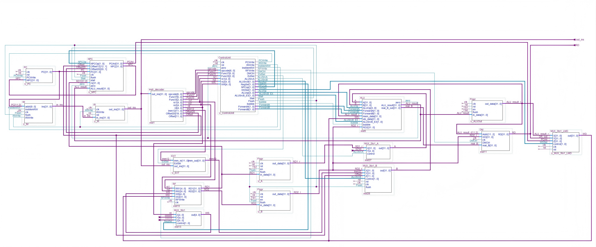

# RV32I Five-Stage Pipeline CPU

A 32-bit five-stage pipelined CPU based on the RISC-V RV32I ISA, implemented in Verilog HDL.

This project focuses on front-end RTL design, pipeline control, hazard handling, and functional verification.

---


## Features

- 32-bit RISC-V RV32I CPU
- Five-stage pipeline architecture: IF, ID, EX, MEM, WB
- Verilog HDL RTL implementation
- Harvard-style instruction and data memory structure
- Support for 16 basic RV32I instructions
- Data forwarding for pipeline hazard reduction
- Load-Use hazard detection with one-cycle stall
- Branch and jump handling with pipeline flush
- Instruction memory address out-of-bound protection
- Functional simulation and waveform debugging with VCS and Verdi

---
## Architecture

The CPU uses a classic five-stage pipeline:

```text
IF → ID → EX → MEM → WB
```

| Stage | Function |
|---|---|
| IF | Instruction fetch |
| ID | Instruction decode and register read |
| EX | ALU execution and branch decision |
| MEM | Data memory access |
| WB | Write-back to register file |




---


## Hazard Handling

The design includes basic hardware mechanisms for pipeline hazard handling.

### Data Hazard

Data hazards are mainly handled by forwarding.

Typical forwarding paths include:

```text
EX/MEM → EX
MEM/WB → EX
```

For Load-Use hazards, the pipeline inserts a one-cycle stall to ensure correct execution.

### Control Hazard

Branch and jump instructions are handled using pipeline flush control.  
Incorrectly fetched instructions are cleared when the control flow changes.

---

## Supported Instructions

This CPU supports 16 basic RV32I instructions.

| Category | Instructions |
|---|---|
| Arithmetic / Logic | `add`, `sub`, `and`, `or`, `xor` |
| Shift | `sll`, `srl`, `sra` |
| Immediate | `addi`, `ori` |
| Load / Store | `lw`, `sw` |
| Branch | `beq`, `bne` |
| Jump | `jal`, `jalr` |

---

## Verification

The CPU was verified through RTL simulation and waveform analysis.

Verified functions include:

- RV32I instruction execution
- Register file read and write
- ALU operations
- Load and store memory access
- Branch and jump control flow
- Data forwarding
- Load-Use stall
- Pipeline flush
- Address out-of-bound protection

Waveform debugging was performed using Verdi to observe pipeline behavior, control signals, register values, ALU results, and memory access.

---

## Repository Structure

```text
rv32i-pipeline-cpu/
├── rtl/        # RTL source files
├── tb/         # Testbench files
├── hex/        # Memory initialization files
├── sim/        # Simulation files and scripts
├── image/      # Architecture diagrams and waveform screenshots
├── .gitignore
└── README.md
```

---

## Simulation

Run simulation with VCS:

```bash
cd sim
make test
```

Or compile manually:

```bash
vcs -full64 -sverilog +v2k ../rtl/*.v ../tb/*.v -debug_access+all -o simv
./simv
```

Open waveform with Verdi:

```bash
make verdi
```

---
## Tools

- Verilog HDL
- VCS
- Verdi
- Linux


## Future Work

- Extend support for more RV32I instructions
- Add branch prediction to reduce control hazard penalty
- Add automated regression tests
- Improve waveform documentation
- Explore FPGA prototype implementation
- Complete backend synthesis and APR flow
## Author

**Zhaowei Cai**  
Microelectronics Science and Engineering  
Nankai University
